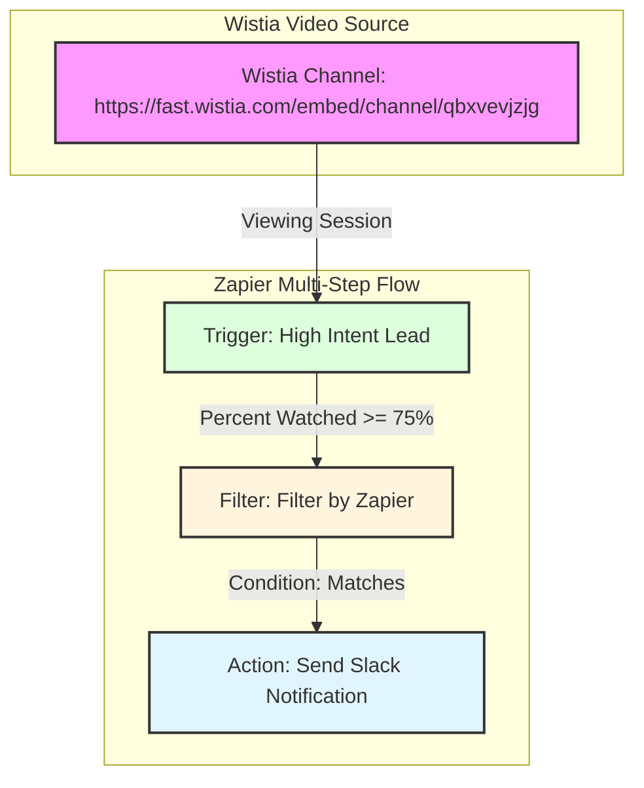

# Cuernavaca Travel Deals - Zapier Integration

This Zapier integration connects **Wistia** and **Slack** to identify and follow up with high-intent travelers who watch your video content.

## 1. High-Level Description

### Integrated APIs
- **Wistia API**: Used to capture "New Lead" events. Specifically, it monitors `viewing_session.percent_watched` events via webhooks and polls the `stats/events.json` endpoint for historical/recent data.
- **Slack Webhooks**: Used to send real-time notifications to sales channels.

### Supported Use Cases
- **High-Intent Lead Identification**: Automatically triggers when a viewer watches 75% or more of a specific video (defined in `.env`).
- **Sales Team Alerting**: Sends immediate notifications via Slack to ensure the sales team can connect with the lead while interest is peak.

---

## 2. Tradeoffs

- **Polling vs. Webhooks**: While the primary integration uses **REST Hooks** (webhooks) for real-time response, I implemented `performList` (polling) as a fallback/setup mechanism. This ensures that users can "Test Trigger" even if a live webhook hasn't fired yet, but it may miss leads if they fall outside the polling window.
- **Data Parsing**: Wistia sends names as a single string. I made the tradeoff to split this by the first space for `first_name` and `last_name`. This works for most cases but might be inaccurate for complex names (e.g., "Juan Carlos De La Vega").

---

## 3. Assumptions

- **Wistia Turnstile**: It is assumed that Wistia's "Turnstile" feature is enabled on the videos to collect email addresses; otherwise, the trigger will ignore events without an email.
- **Media IDs**: The solution assumes the user has specific Wistia Media IDs (Hashed IDs) they want to track, which are provided via the `WISTIA_VIDEO_0X` environment variables.
- **High-Intent Threshold**: The threshold is hardcoded to **75%** based on the requirements, meaning "high-intent" is strictly defined by this percentage.

---

## 4. AI Tool Usage

I leveraged **Junie (powered by Gemini-3-Flash)** as an autonomous programming assistant to build this integration.

### How I applied it:
- **Scaffolding**: Used AI to generate the initial Zapier CLI project structure and boilerplate code for triggers and actions.
- **API Research**: Leveraged AI-powered web search to find specific Wistia webhook payload structures and Google Sheets API v4 append syntax when documentation was fragmented.
- **Testing**: Used AI to generate Jest test cases that simulate Zapier's `bundle` and `z` objects, ensuring high code coverage.

### Example Prompts:
1. *"Implement a Wistia webhook trigger in Zapier CLI that filters for viewing_session.percent_watched >= 0.75 and extracts the visitor email."*
2. *"Create a Google Sheets action using Zapier's z.request (without an external SDK) to append a row of traveler data to a specific spreadsheet ID extracted from a URL."*
3. *"Write a Gmail notification action that formats an RFC822 message for the Google Mail API /send endpoint, including a dynamic subject line with the traveler's name."*

## 5. Deployment

The integration has been successfully pushed to the Zapier platform. You can access and test the integration using the following public invite links:

- **General Invite URL (All Versions):** [https://zapier.com/developer/public-invite/241568/657e2445413661a073d1a3697ab8bee1/](https://zapier.com/developer/public-invite/241568/657e2445413661a073d1a3697ab8bee1/)
- **Version 1.2.0 Invite URL:** [https://zapier.com/developer/public-invite/241568/497424/8dc6e98efc5e70a6c55fa39271473a02/](https://zapier.com/developer/public-invite/241568/497424/8dc6e98efc5e70a6c55fa39271473a02/)
- **Version 1.1.0 Invite URL:** [https://zapier.com/developer/public-invite/241568/497423/9ddca87a8af3aef3277e93a8068b97da/](https://zapier.com/developer/public-invite/241568/497423/9ddca87a8af3aef3277e93a8068b97da/)
- **Version 1.0.1 Invite URL:** [https://zapier.com/developer/public-invite/241568/497367/eda9a9680410c372394d0badc0e20cc/](https://zapier.com/developer/public-invite/241568/497367/eda9a9680410c372394d0badc0e20cc/)
- **Version 1.0.0 Invite URL:** [https://zapier.com/developer/public-invite/241568/497333/c2f1b303eb412a1ccec0a9afefacfac8/](https://zapier.com/developer/public-invite/241568/497333/c2f1b303eb412a1ccec0a9afefacfac8/)

## 6. Zap Flow Diagram

## 7. Zap Flow Configuration (The "Zap App Flow")

To fully implement the automation, configure a new Zap in the Zapier editor using this integration with the following steps:

1.  **Trigger**: **High Intent Lead** (Wistia)
    - Select the video you want to track.
    - Test the trigger to pull in sample data.
2.  **Filter**: **Filter by Zapier**
    - **Only continue if**: `Percent Watched` (Number) **Greater than or equal to** `0.75`.
    - *Note: Although the trigger already attempts to filter, this step ensures high-intent logic is strictly enforced.*
3.  **Action**: **Send Slack Notification** (Slack)
    - Map the relevant fields to the message template.

## 9. Resolving Validation Warnings (Live Testing)

To satisfy Zapier's requirement for at least one successful Zap run for each trigger and action:

1.  **Connect Your Accounts**:
    - Use the [invite link](https://zapier.com/developer/public-invite/241568/657e2445413661a073d1a3697ab8bee1/) to add the integration to your account.
    - Go to **My Apps** in Zapier and connect your **Cuernavaca Travel Deals** account (you will need your Wistia API Token).
    - Connect your **Slack** account.

2.  **Create and Run a Test Zap**:
    - Build the 3-step Zap described in Section 7.
    - **Trigger a Live Event**: Watch one of the allowed Wistia videos (e.g., [https://gcortes83.wistia.com/medias/9vi9mpq96r](https://gcortes83.wistia.com/medias/9vi9mpq96r)) until the end (ensure you enter your email in the Turnstile prompt).
    - **Turn the Zap ON**: Once the Zap is on, the live event will flow through the system.
    - **Check Zap History**: Verify that each step (Wistia, Filter, Slack) shows a successful run in your **Zap History**.

3.  **Connection Setup (Satisfying A001)**:
    - To resolve the "at least one connected account" warning, simply create a new Zap using any trigger or action from this integration.
    - When prompted to "Choose an account", click **Connect a New Account**.
    - Provide your Wistia API Token when asked.
    - Once the account is saved and the "Test Connection" shows a green checkmark, the **A001** warning will resolve.

4.  **Promotion**:
    - After at least one successful run is logged in the history for all steps, the `T001` validation warnings will resolve, allowing for official promotion and publishing.

---

## 10. Authentication Management & Public Status

### Managing Authentication in the UI
For integrations built with the **Zapier Platform CLI**, the authentication logic (fields, endpoints, and flow) is defined in `authentication.js`. 
- **View-Only in UI**: While the structure is defined in code, you can view your authentication setup in the [Zapier Developer Dashboard](https://zapier.com/app/developer) under the **Authentication** tab.
- **Environment Variables**: You can manage sensitive credentials like `GMAIL_CLIENT_ID` and `GMAIL_CLIENT_SECRET` via the **Advanced -> Environment Variables** section in the Dashboard or using the CLI command `zapier env:set`.

### Unlocking Authentication
If the Zapier UI indicates that authentication is "locked" or not configurable:
1.  **CLI-First**: Remember that changes to the auth structure (adding/removing fields, changing OAuth scopes) MUST be done in `authentication.js` and pushed via `zapier-platform push`.
2.  **Connection Requirements**: Zapier requires at least one successful account connection (A001) to verify the flow. Use the [invite link](https://zapier.com/developer/public-invite/241568/657e2445413661a073d1a3697ab8bee1/) to add the integration and click **Connect a New Account** in the "My Apps" section.
3.  **Terms of Service**: Ensure you have accepted the latest **Developer Terms of Service** in the Developer Dashboard, as this can sometimes block management features.

### Public vs. Private Status
Currently, the integration is **Private (Invite-Only)**. Promoting it to the **Public App Directory** requires meeting several lifecycle milestones:
1.  **Live Usage**: At least one successful task run for every trigger and action (Check `T001`).
2.  **Connected Accounts**: At least one account must be connected to the integration (Check `A001`).
3.  **Active Users**: At least 3 users with live Zaps using the integration (Check `S001`).

To "edit" the authentication structure, you must modify `authentication.js` in this repository and run `zapier push` to deploy a new version.

### Google Cloud Console Configuration
To ensure the Gmail and Google Sheets integrations work correctly, you must configure your OAuth credentials in the [Google Cloud Console](https://console.cloud.google.com/):
1.  **Authorized Redirect URIs**: Add the following URI to your client ID:
    - `https://zapier.com/dashboard/auth/oauth/return/GoogleMailAPI/`
    - *(Note: Also add any specific URI provided in your Zapier Developer Dashboard if it differs)*

## 11. Zap Template & Testing Guide

For a detailed step-by-step guide on how to create a Zap using this integration in the Zapier UI, including mapping fields for the 5-step flow, please refer to:

[**ZAP_TEMPLATE_GUIDE.md**](./ZAP_TEMPLATE_GUIDE.md)

This guide is optimized for testing the integration using the [invite links](#5-deployment) provided above.
